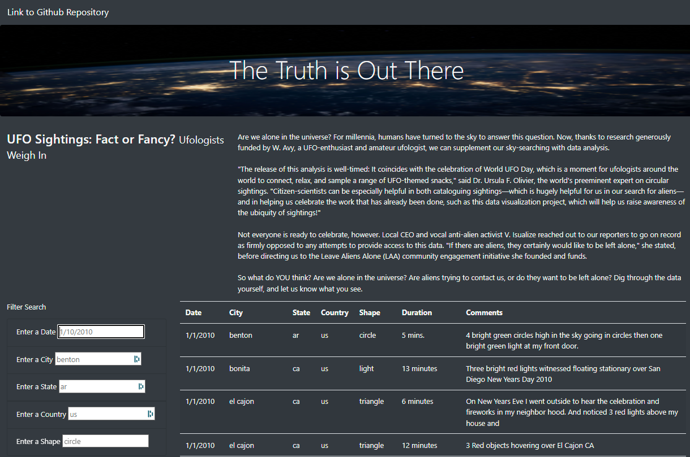
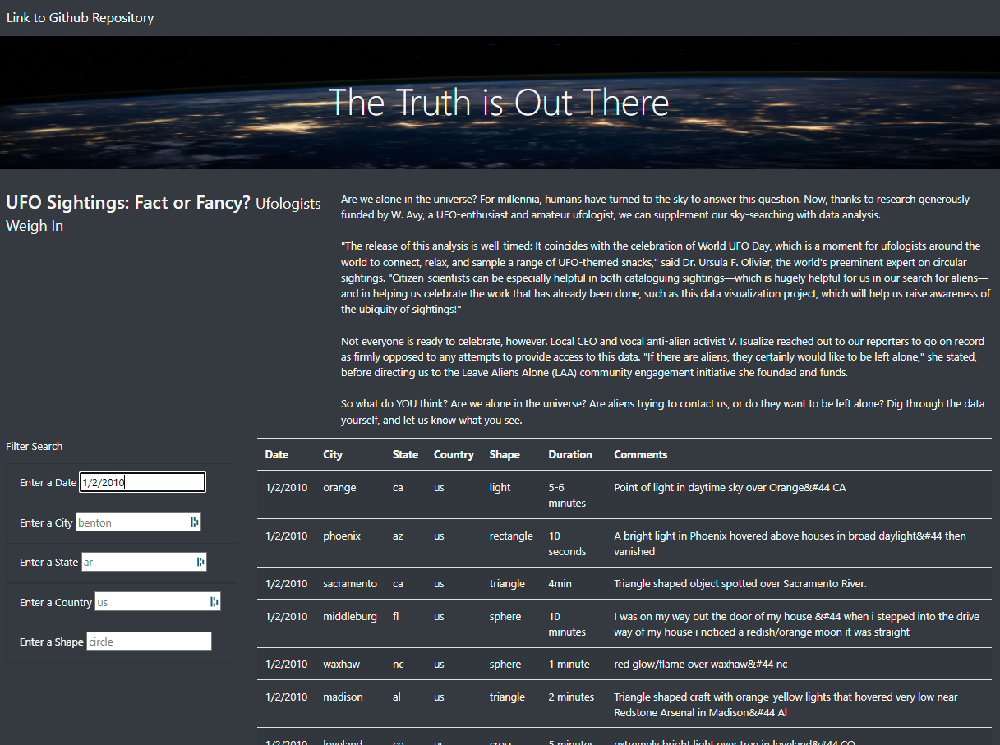
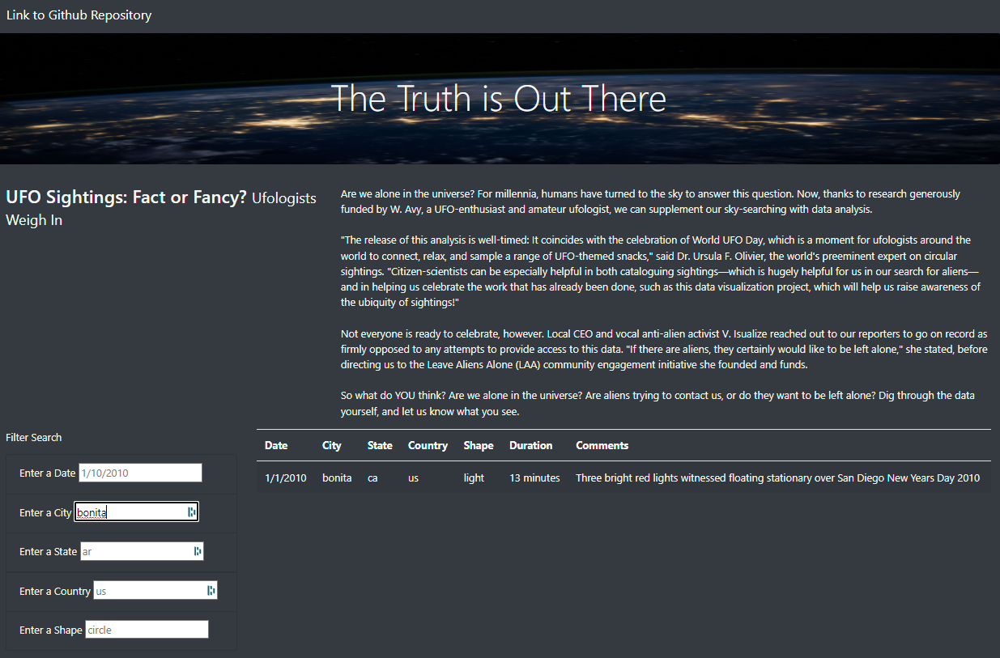

# UFOs
[Deployed Webpage](https://kaalrok.github.io/UFOs/)

## Overview
Dana’s webpage and dynamic table are working as intended, but she’d like to provide a more in-depth analysis of UFO sightings by allowing users to filter for multiple criteria at the same time. In addition to the date, we added table filters for the city, state, country, and shape.

## Analysis
### Overview of Analysis
Are we alone in the universe? This site allows for the user to filter out the locations, times, dates, cities, and the shape of the UFO "sighting". There is a link above to the site. If you would like, you can follow along in the pictures below on "how to" filter the results.

Here is the site:

### Results

There are multiple filters on this site. Luckily, it is very easy to use. Just put in some data, like a date: "1/2/2010" and hit the "Enter" on your keyboard to get this result:

Or, if you would like to search for a city... you could type in "bonita" in the city filter, and hit the "Enter" on your keyboard to get this result:

As you can see the searches are very easy. Refresh the page to try a new search!

### Analysis Summary

One drawback is that the data was not cleaned before using it. So the data itself is all in lower case. This is not very professional in appearance, and it may cause issues with searches if the user is typing in: Bonita vs bonita... as most people would.

Several recommendations for the future would be:

    - Clean the data so that its appearance is professional.
    - Put in a button to refresh the page near the Filter button.

